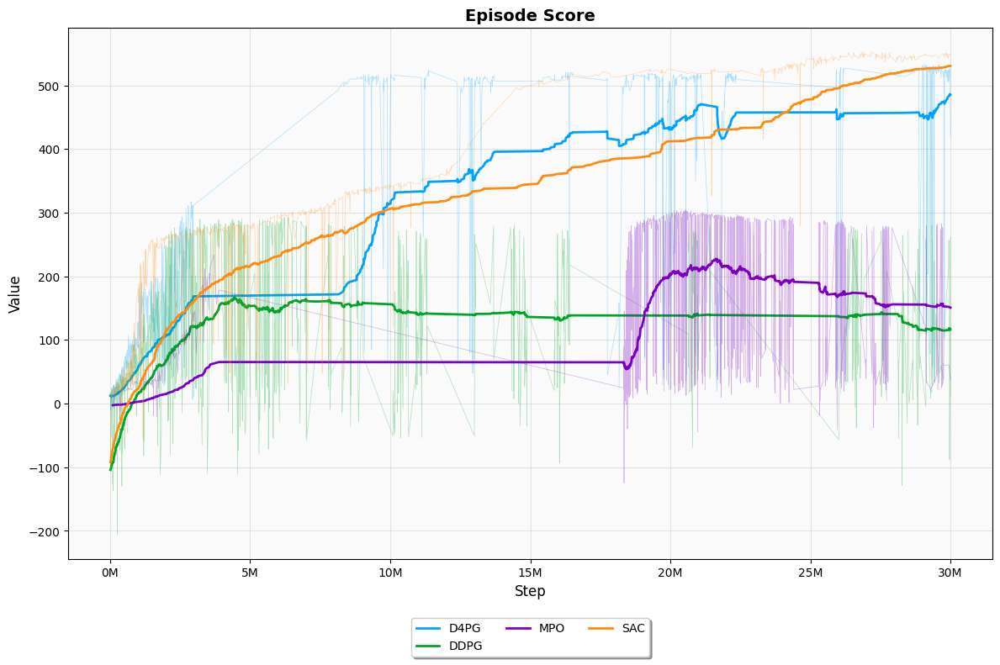
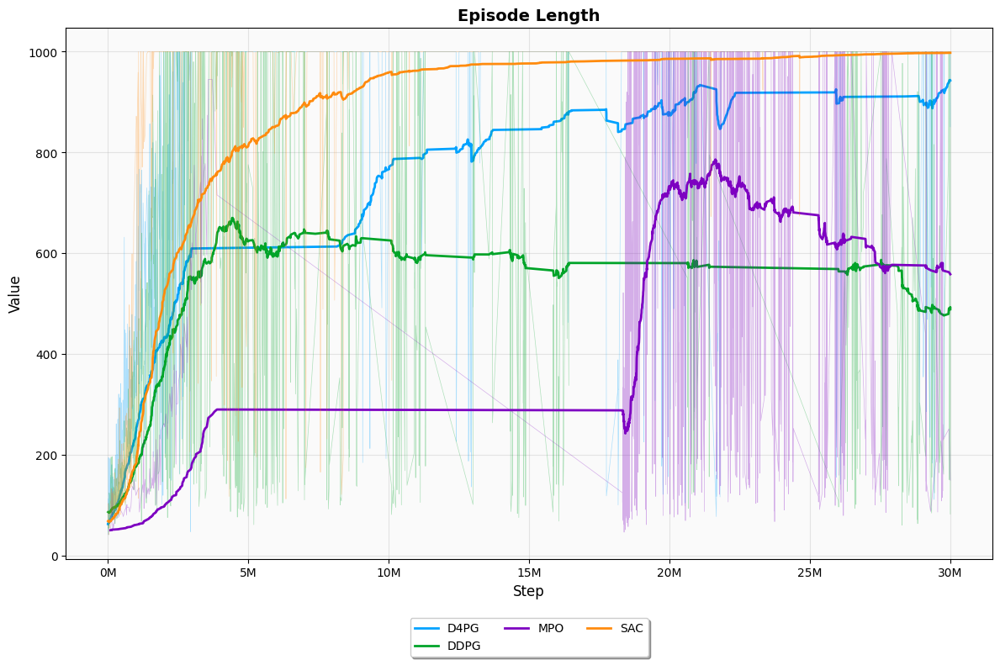
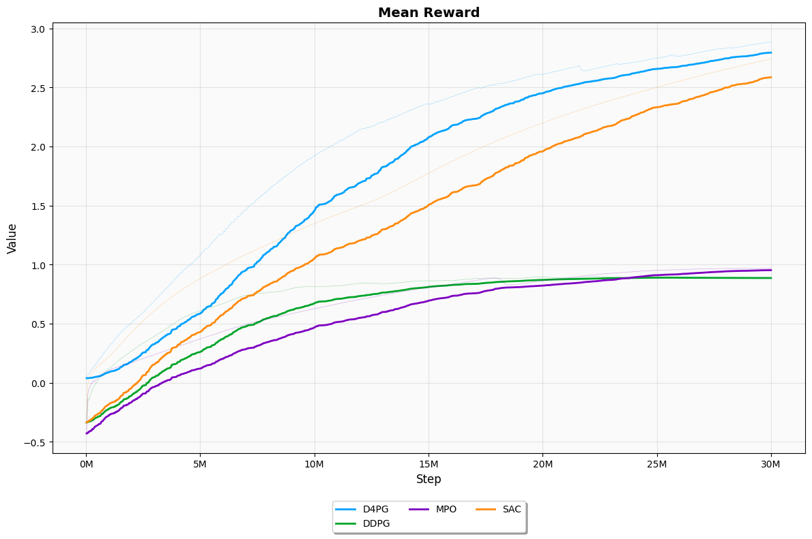
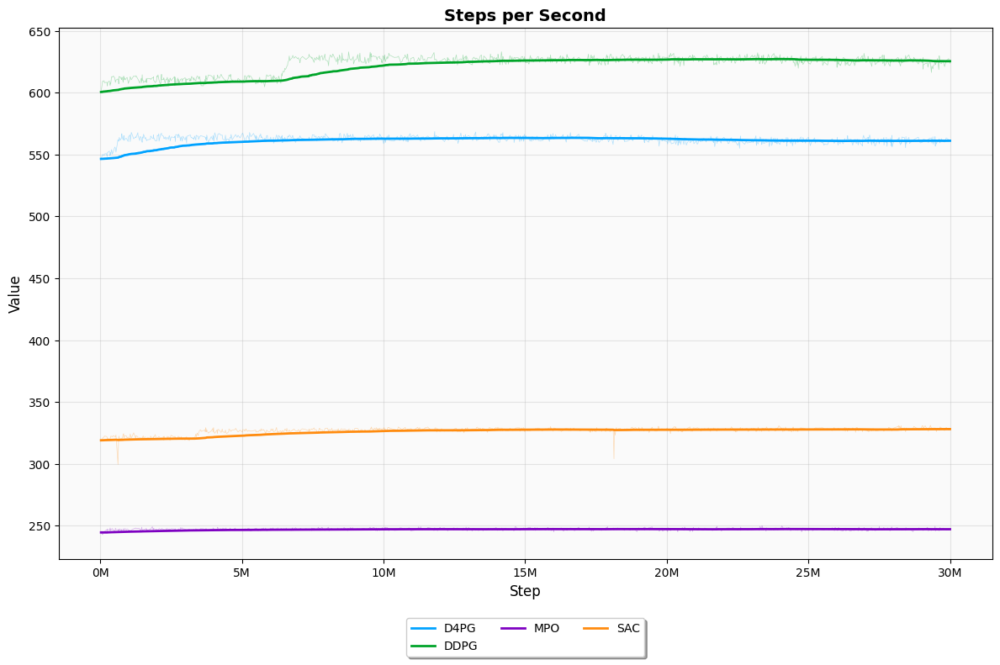

# Biped Robot with Deep Reinforcement Learning

This project explores how to teach a **low-cost biped robot** to walk using **deep reinforcement learning algorithms**. The entire pipeline is designed to be **accessible, reproducible, and modular**, combining simple hardware (12 DOF servos, Jetson Nano) with simulation in **MuJoCo** and training using **PyTorch**.

We compare and evaluate four state-of-the-art RL algorithms for continuous control:
- DDPG (Deep Deterministic Policy Gradient)
- D4PG (Distributed Distributional DDPG)
- SAC (Soft Actor-Critic)
- MPO (Maximum a Posteriori Policy Optimization)

The project aims to **democratize humanoid robotics** by making it feasible to train bipedal locomotion using affordable tools and open-source code.
<p align="center">
  
</p>

---

## 📂 Project Structure

```bash
.
├── models/             # PyTorch models: actor critic networks, DDPG, D4PG, SAC, MPO
├── env/                # MuJoCo simulation environments
├── src/                # Training & evaluation scripts
├── config/             # YAML configs per experiment
├── video/              # Example walking videos
├── data/               # Data and graphs from training runs
├── utils/              # Miscellaneous utilities
├── checkpoints_final/  # Trained models
├── requirements.txt    # required python libraries
└── README.md
```

---

## ⚙️ How to Run

### 1. **Set up the environment**
The project requires Python 3.11+ 
```bash
# Recommended: create a virtual environment
python -m venv venv
source venv/bin/activate  # or venv\Scripts\activate on Windows

# Install dependencies
pip install -r requirements.txt

```

### 2. **Train an agent**
```bash
# Create a new .yaml config file in the config/ folder
# or use an existing one, e.g., config\final\train_config_sac.yaml
# Modify train.py to use your config file (TODO: add it as a command line argument)
# Example command to train using SAC on the flat environment
python src/train.py
```

### 3. **Evaluate a trained model**
```bash
# After training, you can test the model
# Modify src/test_model.py to use your trained model (TODO: add it as a command line argument)
python src/test_model.py
```

### 4. **Visualize results**
Training data is saved to the folder you choose in the config file automatically. To visualize the results, you can use TensorBoard to plot the training curves.

---

## 📊 Results
### Training Curves
<p align="center">
  
  
</p>
<p align="center">
  
  
</p>


---

## 🎥 Walking Demo

<p align="center">
  
</p>

---

## 🧠 Algorithms Summary

| Algorithm | Type       | Strengths                      | Weaknesses                      |
|-----------|------------|--------------------------------|---------------------------------|
| DDPG      | Off-policy | Fast, simple                   | Unstable, outdated              |
| D4PG      | Off-policy | Fast, stable, great for tuning | Not powerful enough             |
| SAC       | Off-policy | Robust, best final performance | Slow training                   |
| MPO       | Off-policy | Theoretically grounded         | Sensitive, complex hyperparams  |

---

## 🧪 Future Work

- Sim-to-real transfer with domain randomization  
- Use of temporal models (LSTM, 1D CNN)  
- Add direction, rotation, and velocity control

---

## 📜 License

MIT License. Feel free to fork, modify, and contribute!

---

## 🤖 Contact

Project by **Pablo Gómez Martínez**  
Contact: [pablodiegogomez@gmail.com](mailto:)

