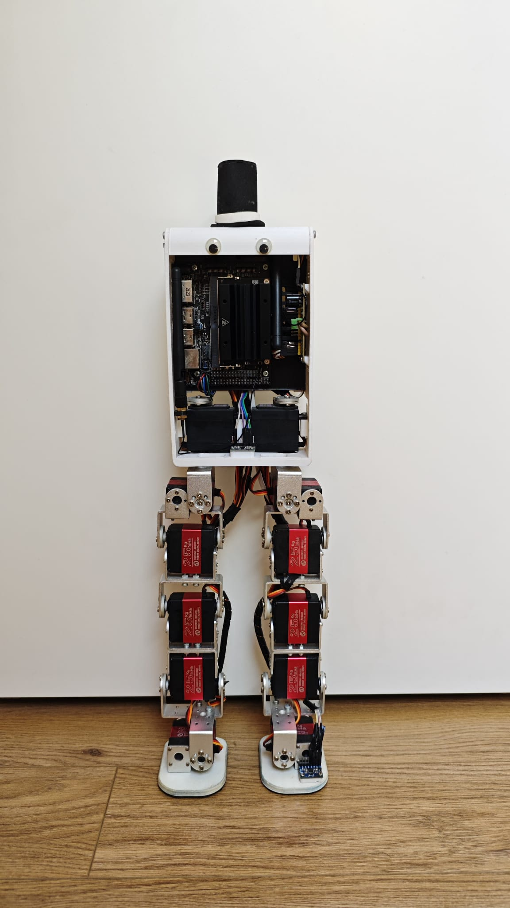
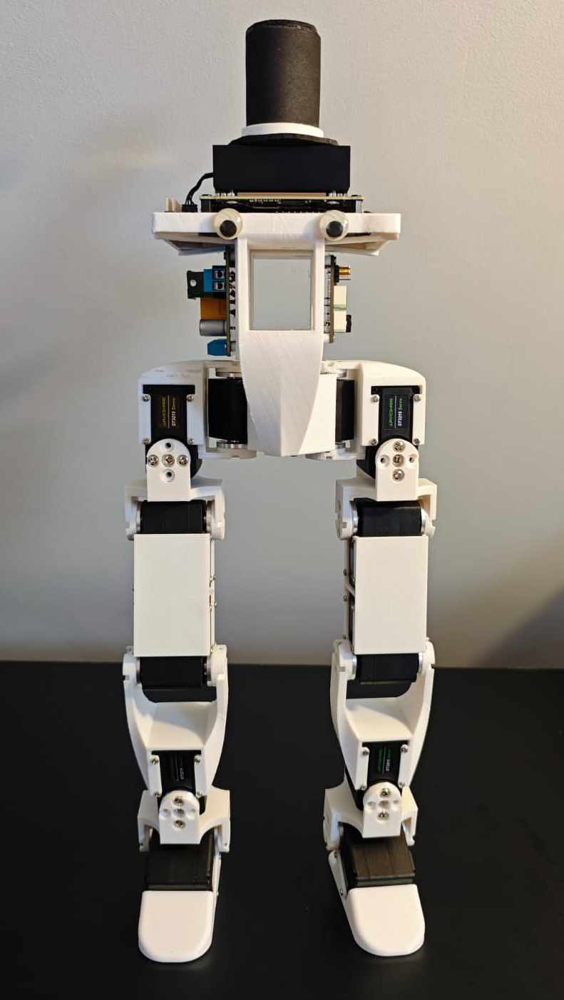
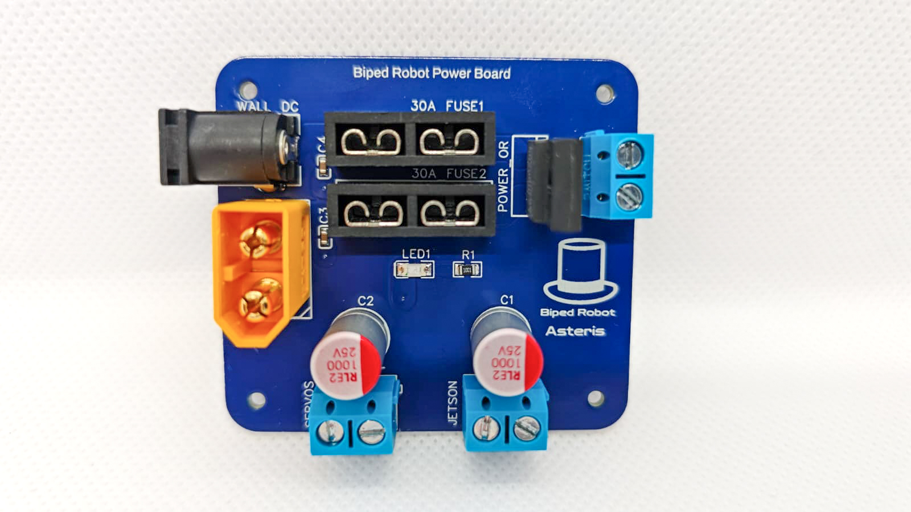

# BipedRobot

<p align="center">
  
  &nbsp;&nbsp;&nbsp;&nbsp;
  
</p>

<p align="center">
  <em>Left: the physical robot. Right: learned gait in simulation.</em>
</p>

---

## About

Started as a hand-animated biped running on Arduino - servos driven by hardcoded angle sequences, no feedback, no learning. Over several years it evolved into a full reinforcement learning system built around a custom-made physical robot.

The primary environment is Isaac Lab (4096 parallel envs, fully on GPU end-to-end - simulation, inference, and training all in torch). MuJoCo is also supported and shares the same observation space, action space, and reward functions, so policies transfer between the two.

Everything was written from scratch: the RL algorithms, the neural network backbones, the environments, the reward functions, and the motion imitation pipeline.

| | |
|--|--|
| **RL algorithms** | PPO, SAC, FastSAC, DDPG, D4PG, MPO |
| **Architectures** | MLP, CNN, LSTM, Causal Transformer - swappable via config |
| **Simulation** | Isaac Lab (primary) + MuJoCo (secondary, identical interface) |
| **Observations** | 48-dim proprioceptive, asymmetric actor-critic with privileged critic obs |
| **Reward** | 18 configurable terms shared between both environments |
| **Motion imitation** | FBX → NPZ pipeline, imitation reward terms for reference tracking |
| **Sim-to-real** | Physics randomization (mass, friction, damping) + left-right obs mirroring |

---

## Quick Start

```bash
# Clone with submodules
git clone --recurse-submodules <repo-url>
cd BipedRobot

# Install dependencies
pip install -r requirements.txt

# Isaac Lab training (primary)
python src/isaaclab/train.py --task BipedRobot \
    --config_path config/isaac/config_working.yaml

# MuJoCo training (no Isaac Lab required)
python src/mujoco/train.py --config config/final/train_config_sac.yaml
```

For Isaac Lab installation, see [Isaac Lab setup](#isaac-lab-setup) below.

---

## Project Structure

```
BipedRobot/
│
├── config/                        # Training configuration (YAML + Pydantic schema)
│   ├── schema.py                  # All config fields with types and defaults
│   ├── final/                     # Production configs (sac, ddpg, d4pg, mpo)
│   └── isaac/                     # Isaac Lab-specific configs
│
├── envs/
│   ├── mujoco/                    # MuJoCo environment
│   │   ├── mujoco_env.py          # MujocoEnv - main Gymnasium environment
│   │   ├── base_env.py            # GLFW rendering, contact helpers
│   │   └── distributed.py         # Multi-worker distribution (Sequential / Parallel)
│   │
│   ├── isaaclab/                  # Isaac Lab GPU environment
│   │   ├── biped_env.py           # BipedEnv (DirectRLEnv, 4096 parallel envs)
│   │   ├── biped_env_cfg.py       # BipedEnvCfg, BipedRobotV2EnvCfg
│   │   ├── rewards/rewards.py     # Shared reward functions (pure PyTorch)
│   │   └── mdp/                   # Commands and terrain logic
│   │
│   ├── rewards/
│   │   └── mujoco_reward.py       # MuJoCo reward - calls shared rewards.py
│   │
│   ├── utils/
│   │   ├── mirroring.py           # Left-right obs/action mirroring
│   │   └── randomizer.py          # Physics randomization
│   │
│   └── assets/                    # Robot model files
│       ├── robot/                 # V1 robot (MuJoCo XML + URDF + USD)
│       └── robotV2/               # V2 robot
│
├── src/
│   ├── mujoco/                    # MuJoCo training entry points
│   │   ├── train.py               # Train (pass --checkpoint to resume)
│   │   ├── train_lstm.py          # Train with LSTM backbone
│   │   └── test_model.py          # Evaluate a saved model
│   │
│   ├── isaaclab/                  # Isaac Lab training entry points
│   │   ├── train.py               # Train (pass --checkpoint to resume)
│   │   ├── play.py                # Evaluate / play
│   │   └── common.py              # Shared IsaacLabWrapper base class
│   │
│   └── tools/                     # Developer utilities
│       ├── plot_symmetry_logs.py  # Plot symmetry error CSVs
│       ├── try_symmetry.py        # Symmetry validator (standalone)
│       └── isaaclab/              # Isaac Lab dev tools
│           ├── debug_env.py       # Interactive joint controller (Tkinter)
│           ├── test_ik.py         # Interactive IK testing (Tkinter)
│           └── try_symmetry.py    # Symmetry validator with TensorBoard
│
├── utils/
│   ├── __init__.py                # Config, NoConfig classes
│   ├── ik_utils.py                # Multi-end-effector IK (Isaac Lab)
│   ├── motion_reference.py        # Motion reference loader (imitation learning)
│   └── free_camera_movement.py    # MuJoCo free camera
│
├── torch-rl-algorithms/           # Submodule: RL algorithms + neural backbones
├── robot-motion-reference/        # Submodule: FBX → NPZ motion pipeline
│
└── requirements.txt
```

> See [`envs/README.md`](envs/README.md) for environment details, how to add robots, and how to add reward terms.  
> See [`config/README.md`](config/README.md) for the full configuration reference.  
> See [`src/README.md`](src/README.md) for every runnable script with all arguments.

---

## Setup

### Dependencies

```bash
pip install -r requirements.txt
```

`requirements.txt` includes `-e torch-rl-algorithms/` - the submodule is installed in editable mode, so changes take effect immediately without reinstalling.

### Submodules

| Submodule | What it is |
|-----------|-----------|
| [`torch-rl-algorithms`](https://github.com/AsterisCrack/torch-rl-algorithms) | PPO, SAC, DDPG, D4PG, MPO algorithms with MLP/CNN/LSTM/Transformer backbones, written from scratch |
| [`robot-motion-reference`](https://github.com/AsterisCrack/robot-motion-reference) | Converts FBX motion capture files to NPZ joint trajectory arrays for use as imitation learning targets |

### Isaac Lab Setup

Install following the [official guide](https://isaac-sim.github.io/IsaacLab/main/source/setup/installation/index.html). Isaac Lab provides `isaaclab`, `isaaclab_tasks`, and the PhysX simulator.

---

## Training

### Isaac Lab

```bash
python src/isaaclab/train.py --task BipedRobot \
    --config_path config/isaac/config_working.yaml
```

| Argument | Default | Description |
|----------|---------|-------------|
| `--task` | `BipedRobot` | `BipedRobot` (V1) or `BipedRobotV2` (V2) |
| `--config_path` | `config/train_config.yaml` | Path to YAML config |
| `--num_envs` | from config | Override number of parallel environments |
| `--checkpoint` | None | Resume from checkpoint path |
| `--headless` | False | Run without GUI |
| `--video` | False | Record video during training |

```bash
# Resume
python src/isaaclab/train.py --task BipedRobot \
    --checkpoint checkpoints/my_run/step_500000.pt

# Play / evaluate
python src/isaaclab/play.py --task BipedRobot \
    --config_path config/isaac/config_working.yaml \
    --checkpoint checkpoints/my_run/step_1000000.pt
```

### MuJoCo

```bash
python src/mujoco/train.py --config config/final/train_config_sac.yaml
```

| Argument | Default | Description |
|----------|---------|-------------|
| `--config` | `config/final/train_config_d4pg.yaml` | Path to YAML config |
| `--checkpoint` | None | Trainer state directory to resume from |

```bash
# Resume
python src/mujoco/train.py --config config/final/train_config_sac.yaml \
    --checkpoint checkpoints/sac/my_run/trainer_state/

# Evaluate
python src/mujoco/test_model.py --config config/final/train_config_sac.yaml \
    --checkpoint checkpoints_final/sac/step_30000000.pt

# Train with LSTM backbone
python src/mujoco/train_lstm.py --config config/final/train_config_mpo.yaml
```

---

## Environments

Both environments expose the same interface: 48-dim observations, normalized `[-1, 1]^12` actions, identical reward functions. Policies transfer between them.

| Property | Isaac Lab | MuJoCo |
|----------|-----------|--------|
| Parallelism | 4096 envs | Sequential or multiprocess |
| Obs (actor) | 48 dims | 48 dims (identical) |
| Obs (critic) | actor + contact scalar | actor + forces + friction + damping + masses |
| Action space | `Box[-1, 1]^12` | `Box[-1, 1]^12` |
| Reward | `envs/isaaclab/rewards/rewards.py` | `envs/rewards/mujoco_reward.py` |
| Reward functions | **Shared** - pure PyTorch, called from both envs | MuJoCo converts numpy→tensor |
| Termination | Tilt > 45° or both feet airborne | Tilt > 45° or height < 0.15 m |

**Observation layout (48 dims):**
```
[lin_acc (3)] [ang_vel_body (3)] [projected_gravity (3)] [commands (3)]
[joint_pos_rel (12)] [joint_vel (12)] [prev_actions (12)]
```

For full environment documentation - how to add robots, modify observations, add reward terms - see [`envs/README.md`](envs/README.md).

---

## Configuration

Configs are YAML files validated against the Pydantic schema in `config/schema.py`. Algorithm, architecture, environment, reward weights, physics randomization - all in one file.

**Minimal example:**
```yaml
train:
  model: "sac"             # sac | ddpg | d4pg | mpo | ppo
  steps: 3.0e7
  worker_groups: 8
  workers_per_group: 16
  seed: 42
  log_dir: "runs"
  checkpoint_path: "checkpoints/"
  model_name: "my_run"
  actor_obs: "normal"
  critic_obs: "privileged"

model:
  actor_config:
    network_type: "mlp"    # mlp | cnn | lstm | transformer
    hidden_sizes: [256, 256]
  critic_config:
    network_type: "mlp"
    hidden_sizes: [256, 256]
  actor_lr: 1.0e-4
  critic_lr: 1.0e-4
```

See `config/final/` for production-tested algorithm configs, `config/isaac/` for Isaac Lab configs, and [`config/README.md`](config/README.md) for the full field reference.

---

## Motion Imitation

The `robot-motion-reference` submodule provides a pipeline to convert FBX motion capture animations into NPZ joint trajectory files. These can be used in Isaac Lab training as imitation reward targets via `track_joint_pos_exp` and `track_joint_vel_exp` reward terms.

```yaml
# In Isaac Lab config:
env_config:
  animation_npz_path: "robot-motion-reference/output/walk.npz"
  animation_loop: true
  animation_speed: 1.0
  animation_random_start: true
rewards:
  track_joint_pos_exp: 1.0
  track_joint_vel_exp: 0.5
```

See the [robot-motion-reference](robot-motion-reference/) submodule for the FBX conversion pipeline.

---

## Developer Tools

| Script | Requires Isaac Lab | Description |
|--------|-------------------|-------------|
| `src/tools/isaaclab/debug_env.py` | Yes | Tkinter UI - drive joints with sliders, inspect root height and contact forces |
| `src/tools/isaaclab/test_ik.py` | Yes | Tkinter UI - set foot IK targets with 6 sliders per foot |
| `src/tools/isaaclab/try_symmetry.py` | Yes | Symmetry validator - logs left/right divergence to TensorBoard |
| `src/tools/try_symmetry.py` | No | Standalone symmetry validator (no Isaac Lab required) |
| `src/tools/plot_symmetry_logs.py` | No | Plot symmetry error CSVs from symmetry tests |

```bash
# Interactive joint controller
python src/tools/isaaclab/debug_env.py --task BipedRobot

# Interactive IK test
python src/tools/isaaclab/test_ik.py --task BipedRobot

# Symmetry validation (no Isaac Lab)
python src/tools/try_symmetry.py --checkpoint checkpoints/my_run/step_1000000.pt
```

---

## Checkpoints

Saved to `checkpoints/<model_name>/step_<N>.pt` during training. Full trainer state (replay buffer + optimizers) is saved to `checkpoints/<model_name>/trainer_state/` for exact resume.

```
checkpoints/
└── my_run/
    ├── step_100000.pt        ← weights only, for evaluation/transfer
    ├── step_200000.pt
    └── trainer_state/        ← full state for resume (replay buffer, optimizers, step count)
```

---

## Hardware & Custom PCB

The latest version of the robot introduces a fully redesigned hardware stack:
- New smart servos with position + velocity feedback 
- Fully 3D-printed structure  
- Custom power distribution PCB for stable and modular wiring

<p align="center">
  
  &nbsp;&nbsp;&nbsp;
  
</p>

<p align="center">
  <em>Left: new robot hardware (V2). Right: custom power distribution PCB.</em>
</p>

The PCB was fabricated and assembled with support from <a href="https://www.pcbway.com/">PCB Way</a>.

Their service made it possible to go from design to assembled board quickly, which significantly accelerated hardware iteration for this project.  
They provide PCB prototyping, assembly, and component sourcing.

🔗 https://www.pcbway.com/

---

## Acknowledgements

<p align="center">
  
</p>

Hardware development for this project was partially supported by <a href="https://www.pcbway.com/">PCB Way</a> (PCB fabrication and assembly).

All design decisions and evaluations remain fully independent.

---

## License

[MIT](LICENSE.txt)
